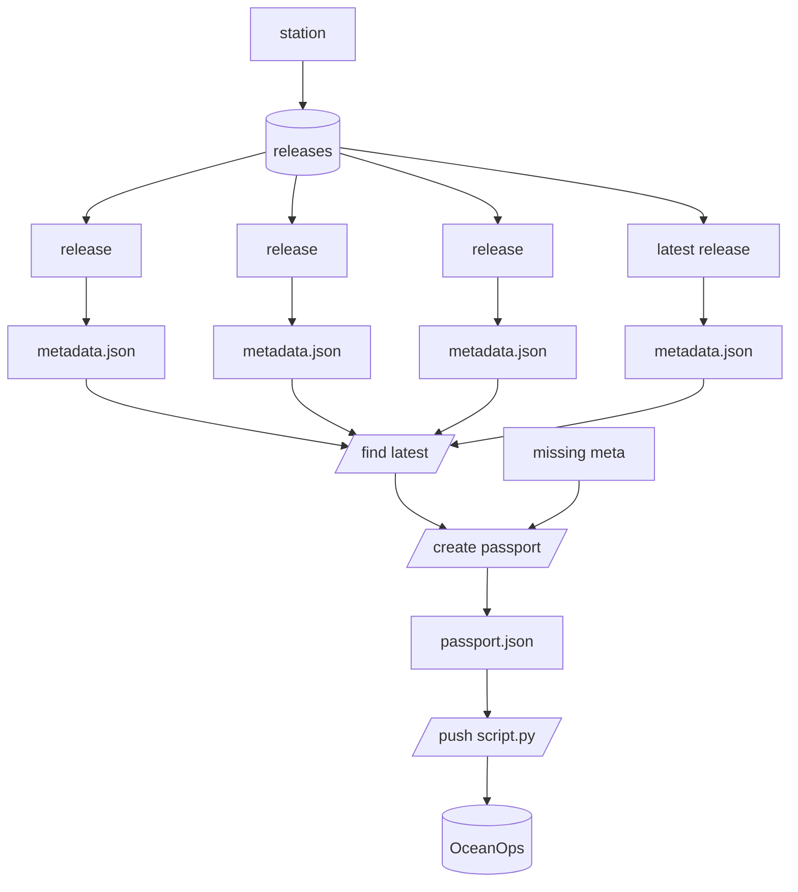
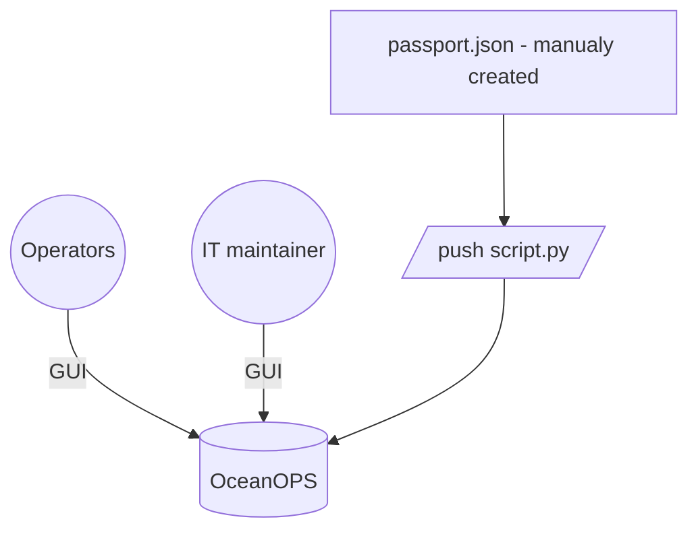

# ICOS ingestion


ICOS data is on ICOS website or accessable via icoscp python library. 

## Structure

E.g Thornton buoy: https://meta.icos-cp.eu/resources/stations/OS_1199
- Each station has data releases. 
- Each release has a metadata json.

## icoscp python lib
The scripts in ```/explore``` demonstrate how to use the icoscp python client 
to 
- 0.list all stations
- 1.search speficif a station + its data releases
- 2.inspect a data release meta.json
- 



## Consideration
- Pushing data from icoscp would require a program that searches the latest data release, and extracts the required fields. 
- This metadata originates from data releases, not from deployment logging (long delays possible)

## Alternative
Limited changes are expected (one station, fixed location). A manual approach 
could do the job.

- Option 1: using the GUI. 
- Option 2: the passport.json is available in this repo and can be pushed by script.


