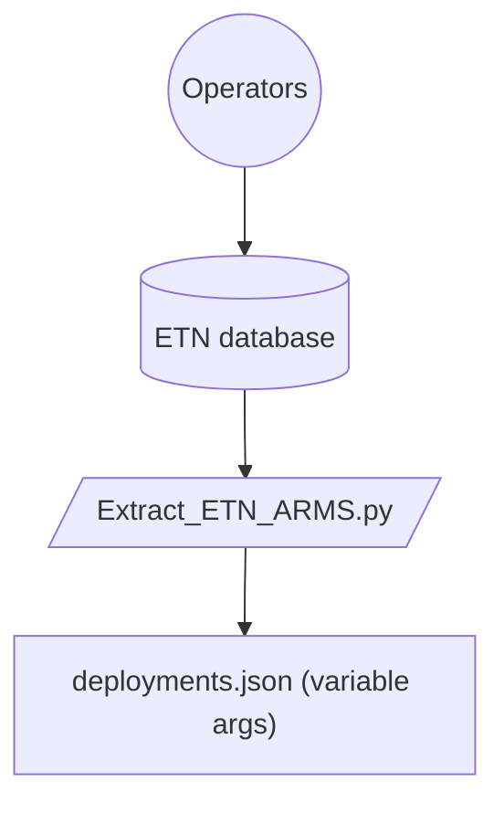
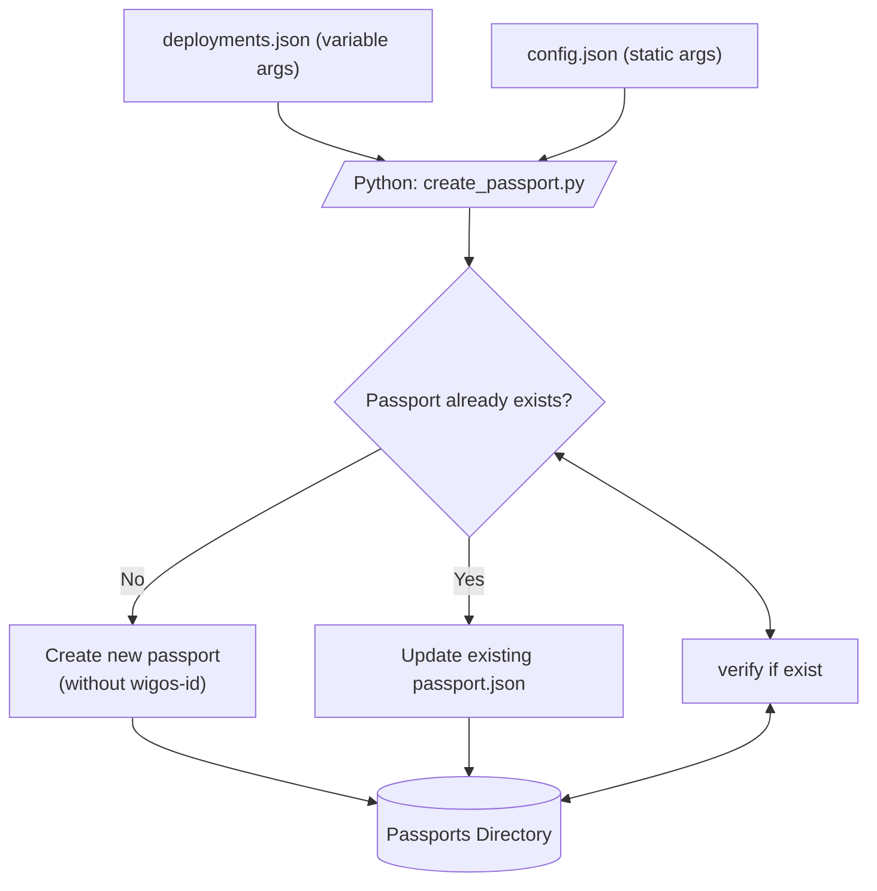
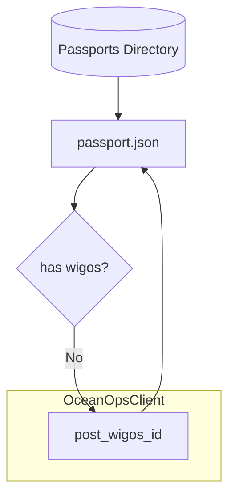
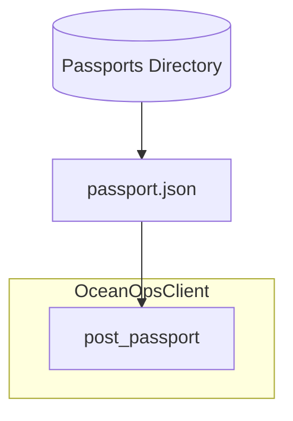

# ARMS ingestion

## Part 1: pull ARMS metadata from ETN

ARMS data is pulled from ETN using ETN R-package.
- The filter parameters are stored in the yaml file.
- The credentials are stored in .Renviron file.

The R code is wrapped in Python for creating a single language pipeline.

The output is a csv file with "variable args":
- the ARMS deployments 
- station name
- ETN id
- lat
- lon
- deploy_date
- retrieval_date

Variable args are expected to change, new records will appear, retrieval dates might be added.


## Part 2: create passport

The variable args are merged with static args (e.g. contacts, sensor names). 

Before creating a json file, it is verified if this platform already exists. 
This is done by assessing whether lat/lon/deploy_data/station_name are unique. 

- In case the passport already exists, the existing file is updated. The filename is ```ETN_{ETN_id}_WIGOS_{WIGOS_id}.json```
- In case the passport does not yet exists, it is created. The filename is ```ETN_{ETN_id}_WIGOS_NONE.json```

For now the check is done using the json files already in passports directory. 
Ideally, this check would assess existence in OceanOps itself. 

! This means that you need to have all previously created passports in that directory. 
<br> 
Otherwise the assessment will show they do not yet exist and create passports with new WIGOS-IDs.



## Part 3: Assign WIGOS-ID if missing
For new passports a new WIGOS-ID is requested and assigned in the json field and in the filename.
You will need to confirm in the command line every time before a new WIGOS ID will be created.
All passports have now a name like ```ETN_{ETN_id}_WIGOS_{WIGOS_id}.json```



## Part 4: Push passports

Pushing the passport.json to OceanOps.

